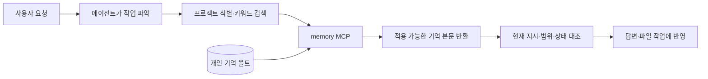

# 개인 메모리 구성도 — 근거와 검증

[인터랙티브 구성도](memory-system.html) · [편집 원본](memory-system.architecture.json)

## 확인 범위

2026-09-15 저장소 코드와 적용 기록을 대조했다. 실제 볼트, 전역 설정, launchd 상태를 이번 작업에서 감사하거나 변경하지 않았다. 이 세션에서는 memory_project_resolve와 memory_search의 실제 응답을 확인했다. 노트 수는 운영 기록 당시 수치이며 현재 볼트 재집계가 아니다.

- [운영 연결 기록](../memory-operations-validation.md): Claude Code·Codex의 로컬 stdio memory MCP, 핵심 제공, 승인 파생 노트 4개와 보존된 legacy 104개. CLI마다 별도 memory 프로세스가 같은 볼트를 사용한다.
- [memory MCP 코드](../../scripts/memory_mcp.py): 프로젝트 root/명시 ID 식별, AND 부분문자열 검색, valid confirmed 및 범위 일치 필터, 완전한 metadata 검증·scrub·노트 원자 쓰기·인덱스 갱신. 후보·legacy 검토 조회는 자동 적용 승인이 아니다.
- [핵심 제공 코드](../../scripts/memory_session.py): 승인 core manifest를 제공한다. 핵심 제공 실패를 전체 인덱스로 대체하지 않는다. 훅이 없는 환경에서는 memory_core_get을 사용한다.
- [Stop 훅 보강](../memory-tick-hook-validation.md): 세션별 60분은 저장 성공 간격이 아니라 저장 가치 평가 요청 간격이다. 에이전트가 중복·범위·상태를 판단하고 MCP로 저장한다. 훅이 직접 노트를 저장하는 화살표로 해석하지 않는다.
- [기존 전체 구성](../../README.md): seCall 공유 HTTP MCP, 아카이브·위키, scrub→sync 및 wiki·감시 launchd. README의 30분 Stop·전체 인덱스 주입 설명은 최신 운영 기록으로 대체해 읽었다. iCloud 관련 옛 설명도 현재 로컬 볼트와 혼동하지 않는다. seCall은 개인 memory 노트를 검색하는 경로가 아니다.
- [사례 목록](../case-knowledge/README.md)과 [C4 결과](../memory-case-knowledge-c4-results.md): 사례 3개 검토 완료, 24조건 시도·23완료·1시작 오류, 행동 16 pass·7 fail·1 평가 불가, 비교 11쌍 중 개선 1·동률 10. 자동 회상 연결은 평가하지 않았다.
- [C5 결정안](../memory-case-knowledge-c5-decision.md): 사용자 확인 대기. 후속 질문을 승인으로 취급하지 않았다.

## 읽는 방법과 남은 일

주 경로는 에이전트 → memory MCP → 개인 기억 볼트다. 화살표는 요청·처리 방향이며 반환 응답은 생략했다. 세션 시작의 핵심 제공, 요청별 관련 검색, Stop의 저장 가치 평가는 서로 다른 시점의 동작이다. 검색 뒤 현재 지시·범위·상태를 확인하고 적용한다.

### 회상 반환 경로와 목표 달성 범위

구성도에서 생략한 반환·적용 경로는 다음과 같다. 볼트에서 연결이 끝난다는 뜻이 아니다.



[최초 회상 설계](../superpowers/specs/2026-09-10-memory-retrieval-design.md)의 목표는 사용자가 기억을 다시 언급하지 않아도 관련 선호·정정·제약을 행동에 반영하는 것이다. 기본 경로는 구현·연결됐지만, 기존 기억 전체의 활용 전환이나 지속적 검색 성공까지 완료된 것은 아니다. 운영 기록 기준 기존 104개 legacy는 기본 검색에서 제외된다. [고정 평가](../memory-retrieval-t4-restoration-validation.md)의 행동 44/44·회상 연결 21/22는 전체 운영 기억의 성공률이 아니다. Claude MR-002의 키워드 미적중은 보류돼 있다.

Claude 전용 검색 제어는 [당시 평가](../memory-retrieval-t4-remediation-validation.md)에서 MR-001/007/009의 검색 생략이 남아 보강한 것이다. Codex는 그 평가의 회상 연결 11/11을 통과했고, [운영 계획](../superpowers/plans/2026-09-14-memory-retrieval-operations-plan.md)은 기존 핵심·지침·MCP 연결을 재현하는 범위로 정했다. Codex에 강제 제어가 불가능하다는 뜻이 아니며, 같은 제어를 추가하려면 환경에 맞는 어댑터와 검증이 필요하다.

현재 남은 회상 작업의 우선 검토 대상은 필요한 legacy 기억의 점진적 검토·전환과 실제 작업의 검색·적용 확인이다. 이는 후속 권고이며 이번 문서 커밋이 볼트 전환이나 추가 모델 실행을 승인·완료했다는 뜻은 아니다.

seCall은 과거 대화와 근거를 찾는 별도 경로다. 대화 수집에는 비밀값 마스킹과 정기 수집이 있고, 검색 인덱스는 로컬 파생 자료다. 개인 기억과 같은 상위 볼트를 쓰더라도 역할과 검색 경로는 별개다.

사례 문서와 C4는 제품 MCP·훅과 분리해 그렸다. 에이전트가 필요할 때 명시적으로 문서를 읽을 수 있지만 자동 추출·검색 연결은 없다. 문서 조회의 제공/열람/적용/효과도 각각 구분한다.

남은 범위는 legacy 점진 검토, 보류된 키워드 회상 실패, MCP 동시 writer 직렬화, 배포 생명주기 변경 뒤 전체 모델 회귀다. 로컬 61개 테스트 통과를 실제 운영의 전 행동 성공으로 해석하지 않는다. 사례 쪽은 재조사 감소 미관찰, 미열람 및 CLI 임시 경로 간섭이 남아 있다.

## 산출물 검증

- diagram_type: architecture
- validation: 9/9 showcase, 0 errors, 0 warnings
- browser_evidence: passed
- visual_review: passed — 1440×900 light / 2048×1320 dark 캡처의 선·라벨·카드·화면 균형 확인
- correction_rounds: 2 — 초기 라벨 위치, 데스크톱 세로 여백 조정
- 자동 브라우저 검증: 1440×900, 1600×1000, 1920×1080, 2048×1320에서 가로·세로 넘침 없음. 양 끝 크기의 light/dark 캡처 완료. 초기 sandbox Chrome 실패 후 허용된 로컬 Chrome 검증으로 재확인했다.
- [자동 브라우저 영수증](memory-system.visual-check.json) · [캡처 모음](memory-system.visual-check.html)
- 구성도 본문은 한국어다. 고정 Viewer UI와 HTML lang은 도구 지원 범위에 따라 영어로 표시된다.

```text
specification_sha256: fda752a5b64f2817356dc08984fc1e8b6538c44a443abf7d7cc687630c954edf
specification_bytes: 4607
artifact_sha256: 7658d038d95bb2bbdc4ae635ff5fd961b67ca909dd0a4a6c798ad79c966bf635
artifact_bytes: 712672
```
